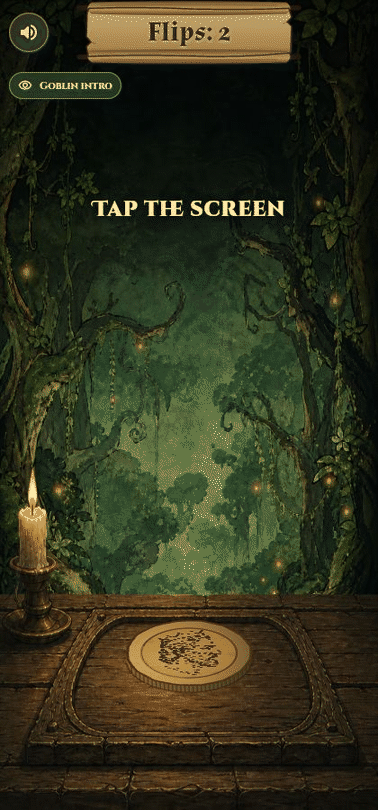

# Goblin Flip

Goblin Flip is a fantasy coin-flip game built with Flutter. Players build a
balance of flips, unlock a goblin gambler, place wagers,
and buy charms that alter future outcomes. Flips have no cash value and cannot
be transferred or redeemed.



## Highlights

- Animated coin tosses with custom fantasy artwork and sound
- Persistent wagers that recover safely after interrupted sessions
- Insurance, Roll Back Time, and Speed Flip charms
- Authenticated local saves with rollback and replay protection
- Responsive layouts for Android phones and the web preview
- Automated gameplay, persistence, security, and release tests

## Development

Requirements: Flutter 3.44.8 or newer and Android SDK 36.

```powershell
flutter pub get
flutter analyze
flutter test
flutter run
```

Windows helpers are included for running the web preview, testing, building an
Android APK, installing it on a connected phone, and producing a signed Android
App Bundle.

## Structure

- `lib/game_state.dart` contains the game rules and persistent state model.
- `lib/game_state_store.dart` protects local saves and recovery copies.
- `lib/presentation/` contains the scene, controls, effects, and menus.
- `test/` covers gameplay transitions, persistence attacks, commerce receipts,
  responsive layouts, and release configuration.

Real purchases and rewarded ads remain disabled in release builds until their
store providers and verification service are configured. See
[ROADMAP.md](ROADMAP.md) for the Android and iOS release plan.
Signing material, provider credentials, and machine-specific configuration are
intentionally excluded from the public project.

Third-party audio and font notices are stored with their respective assets.

## Project status

This is an independent student project in active development. The core game,
local persistence, automated tests, and Android build pipeline are working.
Production purchases, rewarded ads, store publication, and Apple-device
validation remain on the roadmap.

Copyright © 2026 Andrew Weeden. All rights reserved. See [LICENSE](LICENSE).
